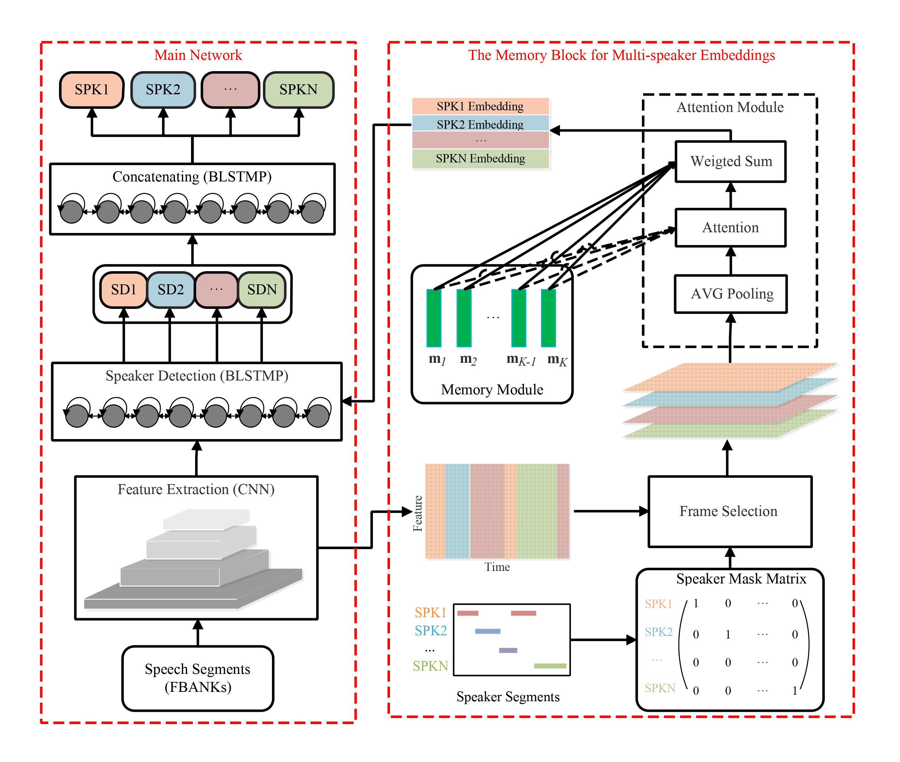

# NSD-MA-MSE
This repository is a pytorch implementation of the paper "ANSD-MA-MSE: Adaptive Neural Speaker Diarization Using Memory-Aware Multi-Speaker Embedding", for more details please see [paper](doc/ANSD-MA-MSE_Adaptive_Neural_Speaker_Diarization_Using_Memory-Aware_Multi-Speaker_Embedding.pdf)
.

## Results


## Pretrain Model
The model trained on AMI dataset can be found [here](https://drive.google.com/file/d/1xq-U8CkEymU661_177IqlvId6piULTiU/view?usp=sharing), with results of 11.19 on the AMI development set and 11.81 on the test set (oracle VAD, th=0.5).

## Decoding

You can check the decoding results with the following decoding commands:

```
 # AMI dev
 bash decode_MULTI_SE_MA_MSE_NSD_AMI.sh --stage 3 --data AMI_Headset_dev --sets dev
 
 # AMI test
 bash decode_MULTI_SE_MA_MSE_NSD_AMI.sh --stage 3 --data AMI_Headset_test --sets test
```

## Citation

If you find this code useful in your research, please consider to cite the following papers:

```bibtex
@ARTICLE{10093997,
  author={He, Mao-Kui and Du, Jun and Liu, Qing-Feng and Lee, Chin-Hui},
  journal={IEEE/ACM Transactions on Audio, Speech, and Language Processing}, 
  title={ANSD-MA-MSE: Adaptive Neural Speaker Diarization Using Memory-Aware Multi-Speaker Embedding}, 
  year={2023},
  volume={31},
  number={},
  pages={1561-1573},
  doi={10.1109/TASLP.2023.3265199}}

```
